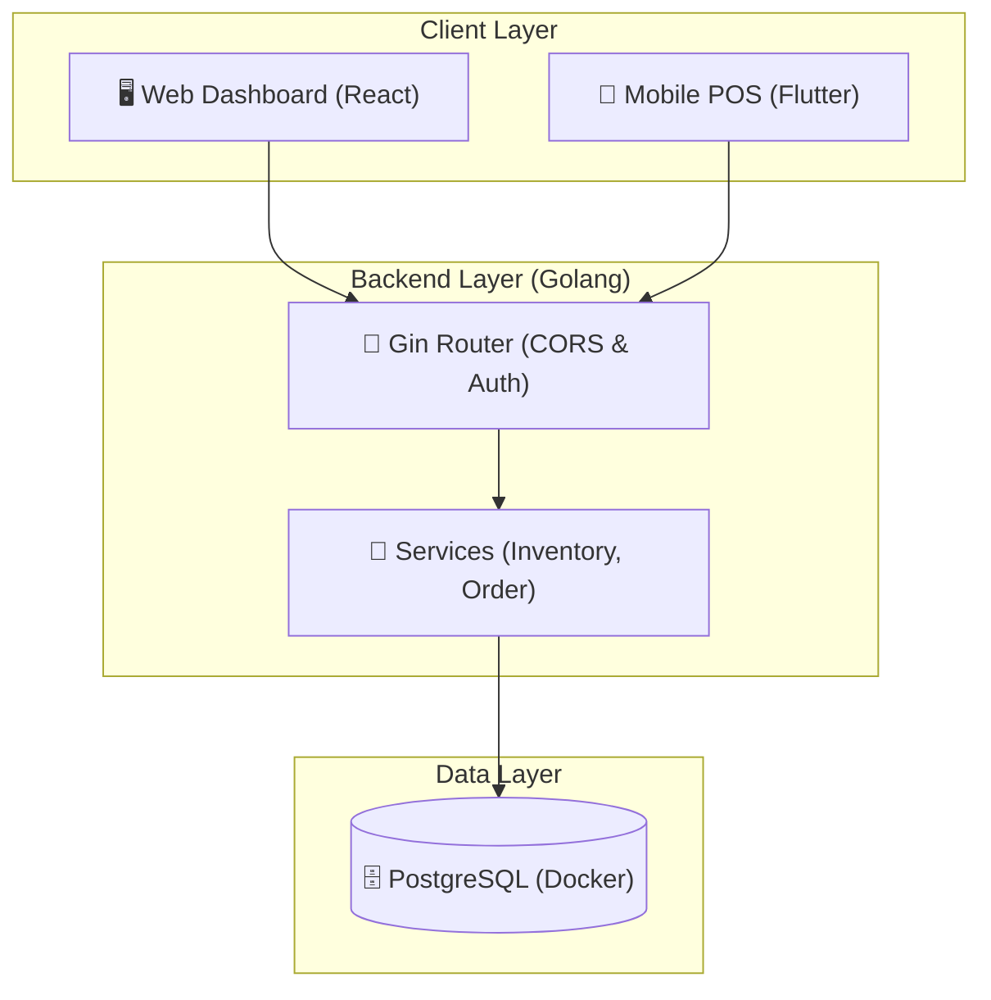

# PROGRES PENGEMBANGAN SISTEM MOKA POS - SINGGAH COFFEE
**Status Terakhir: 3 Februari 2026 (04:30 AM)**

Dokumen ini merangkum seluruh pencapaian pengembangan, fitur yang telah diintegrasikan secara rill, dan status sistem saat ini.

---

## 🚀 UPDATE INTEGRASI DATA RILL (3 Feb 2026)
Seluruh sistem kini telah melewati fase **Backend System Audit** dan **Integration Phase**. Fitur-fitur berikut telah terhubung sepenuhnya dengan data rill:

- **Dashboard Utama**: Menampilkan summary total penjualan hari ini, pesanan aktif, stok menipis, dan transaksi hari ini secara *real-time* dari PostgreSQL.
- **Analytics & Trend**: Grafik penjualan (`SalesChart`) kini menampilkan data per jam (Hourly Trend) langsung dari database.
- **Top Products**: List item terlaris kini dihitung secara dinamis berdasarkan kuantitas penjualan rill.
- **Reporting System**: Halaman laporan (`Reports`) kini menyajikan data rill pendapatan kotor, estimasi HPP (40%), laba bersih, dan breakdown kategori (Coffee vs Food vs Others).
- **Transaction Audit**: Fitur `Void Order` ditambahkan untuk membatalkan transaksi yang salah, dengan proteksi *role-based* (Owner/Manager).
- **Menu Management Audit**: Ditambahkan fitur `Delete Product` dengan pembersihan relasi resep secara *transactional* di database.

---

## 1. Rangkuman Pekerjaan (Completed vs Pending)

### ✅ SELESAI (Completed)

#### **A. Backend & Infrastructure (Core)**
*   **Bahasa & Framework**: Golang (Gin Framework) + GORM ORM.
*   **Database**: PostgreSQL 15 (Dockerized) dengan Auto-Migration.
*   **Authentication**: JWT-based Auth (Login, Register, Middleware Protection).
*   **Manajemen Produk**: CRUD Produk lengkap dengan dukungan **Resep (Recipe)** & Kalkulasi HPP (COGS).
*   **Manajemen Inventory**:
    *   **Architecture Update**: Refactoring logic ke `InventoryService` untuk testability.
    *   Database Bahan Baku (Ingredients) dengan pelacakan unit (gr, ml, pcs).
    *   **Stock Mutation**: Logika Mutasi Stok (Masuk/Keluar) untuk audit trail.
    *   **Auto-Deduction**: Logika otomatis potong stok bahan baku saat pesanan dibuat.
*   **Audit Trail & Maintenance**:
    *   **Void Order**: POST `/api/orders/:id/void` untuk pembatalan transaksi.
    *   **Delete Cleanup**: SQL Cascade/Manual cleanup untuk data produk dan resep.
*   **Security (Zero Trust)**:
    *   **RBAC Protection**: Middleware `RoleMiddleware` untuk membatasi akses endpoint sensitif (Owner/Manager saja yang bisa melihat HPP/Cost).
    *   **Data Privacy**: Endpoint `GetProducts` dan `GetIngredients` menyembunyikan field sensitif untuk role non-manajerial.

#### **B. Frontend Web Dashboard (Owner/Admin)**
*   **Tech Stack**: React + TypeScript + Tailwind CSS + Lucide Icons.
*   **Status**: ✅ **Fully Integrated with Real-time Data**.
*   **Fitur Terintegrasi**:
    *   **Real-time Dashboard**: Summary cards, Hourly Sales Chart, dan Top Selling Items list.
    *   **Sales & Transactions History**: List transaksi rill dengan detail struk digital dan fitur Void.
    *   **Menu & Inventory Manager**: Manajemen produk, resep, dan stok bahan baku dengan feedback visual (Badge: Recipe Linked, Low Stock).
    *   **Integrated Reporting**: Laporan performa harian dengan breakdown kategori yang dihitung otomatis dari backend.
    *   **Settings System**: Pengaturan profil toko, pajak/service charge rill, dan upload logo.

#### **C. Mobile App (Cashier Tablet)**
*   **Tech Stack**: Flutter (Android/iOS).
*   **Status**: ✅ **Operational & Connected**.
*   **Fitur**:
    *   **POS Interface**: Layout tablet (Split View) untuk efisiensi kasir.
    *   **Checkout Flow**: Pengiriman order memicu kalkulasi pajak/service di backend dan pemotongan stok bahan baku.
*   **Verification**: Lolos **System Integration Test** rill (Login -> Order -> Stock Deduction Verification).

---

### ⏳ TERHAMBAT & BELUM SELESAI

#### **⚠️ KRITIS: Disk Space (Flutter Installation)**
*   **Masalah**: Instalasi Flutter SDK di mesin gagal (Disk Full). Hanya tersisa **1.5 GB** sedangkan ekstraksi Flutter butuh ~10 GB.
*   **Tindakan Dibutuhkan**: User perlu membersihkan ruang penyimpanan di drive utama sebelum instalasi bisa dilanjutkan.

#### **A. Fitur Advanced (Phase 3)**
1.  **Laporan Mendalam**: API Real-time untuk Laba Rugi (P&L) berdasarkan HPP.
2.  **Integrasi Pembayaran**: Koneksi ke Xendit/Midtrans untuk QRIS dinamis.
3.  **Printer Struk**: Integrasi Bluetooth Printer pada Web POS & Mobile App.

---

## 2. Arsitektur Enterprise Terupdate (As-Built)

---

## 3. Akun Default & Port
*   **Web Dashboard**: `http://localhost:51xx` (Cek terminal saat startup).
*   **Backend API**: `http://localhost:8080`.
*   **Database Admin**: `owner@singgah.coffee` / `admin`.

**Dokumen ini disimpan di:** `PROJECT_STATUS.md`
Berikut langkah cepat (macOS, zsh) untuk menjalankan backend (localhost) dan aplikasi Flutter — pilih salah satu target Flutter (iOS Simulator, Android emulator, atau Web). Mau saya jalankan sekarang? Jika ya: pilih target.

Ringkasan singkat (direktori workspace = root project)

Backend API: http://localhost:8080 (API root biasanya /api)
Database lokal (docker-compose) memetakan Postgres ke localhost:5434
Flutter app mengarah ke http://localhost:8080/api
Perintah (jalankan di Terminal — satu per terminal atau saya bisa jalankan untuk Anda)

Cara cepat — gunakan Docker (direkomendasikan)
Start PostgreSQL:
cd "/Volumes/WORK/PROJECT PROTOTYPE/SISTEM MOKA POS SINGGAH COFFEE"
docker-compose up -d db
Jalankan backend di container:
docker-compose up --build -d api
Verifikasi:
curl http://localhost:8080/api || curl http://localhost:8080
Jalankan backend secara lokal (hot-reload selama development) — pastikan Docker berjalan untuk DB
Start DB:
docker-compose up -d db
Jalankan server Go (dari folder backend):
cd backend
go run ./cmd/server
Verifikasi:
curl http://localhost:8080/api
Jalankan Flutter (pilih salah satu)
Siapkan:
cd mobile-app
flutter pub get
iOS Simulator (macOS):
open -a Simulator
flutter devices
flutter run -d <device-id> # atau hanya flutter run untuk device default
Android emulator:
(jalankan emulator terlebih dahulu dengan Android Studio)
flutter run -d emulator-5554
Web (Chrome):
flutter run -d chrome
Jalankan web-server (akses dari browser di device lain):
flutter run -d web-server --web-port=5000
Menjalankan semuanya bersamaan (contoh — backend lokal + Flutter di simulator)

Terminal A (DB + backend):
cd <project-root> && docker-compose up -d db && cd backend && go run ./cmd/server
Terminal B (Flutter):
cd mobile-app && flutter run
Troubleshoot cepat

Jika Flutter tidak menemukan perangkat: jalankan flutter doctor dan open -a Simulator
Jika backend gagal konek DB: pastikan Docker aktif dan Postgres jalan pada port 5434 (docker ps), atau sesuaikan .env
Android emulator gunakan 10.0.2.2 untuk mengakses localhost (project sudah menangani ini di constants)