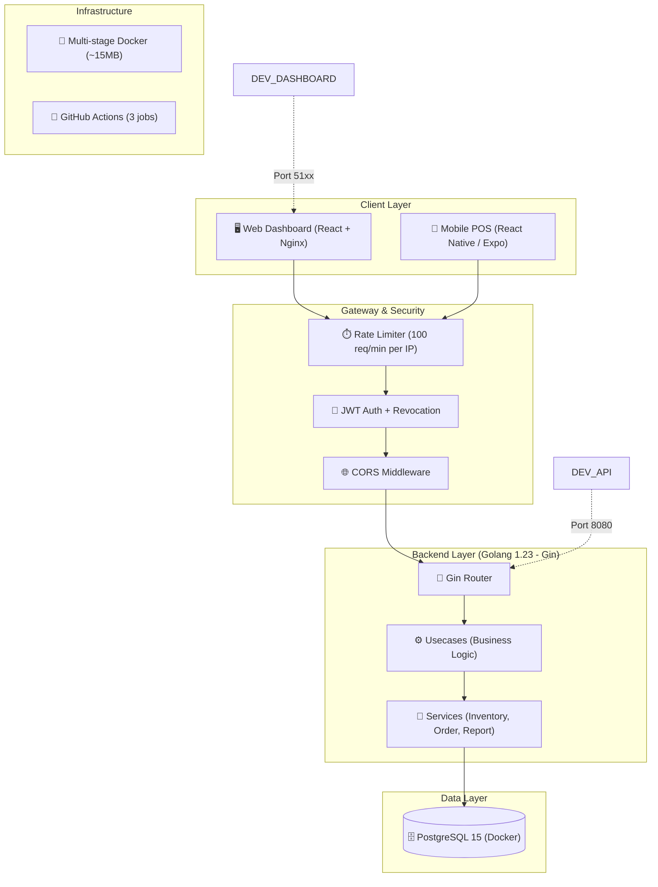

# PROGRES PENGEMBANGAN SISTEM MOKA POS - SINGGAH COFFEE
**Status Terakhir: 2 Juni 2026**

Dokumen ini merangkum seluruh pencapaian pengembangan, fitur yang telah diintegrasikan secara rill, dan status sistem saat ini.

---

Sistem telah melewati fase **Production Hardening** secara menyeluruh. Seluruh **4 prioritas** (Security, Backend Core, Testing, Frontend/Mobile) telah terselesaikan. Backend telah dilengkapi JWT revocation, rate limiter, dan multi-stage Docker (~15MB image). Unit testing mencakup 42 test case di 7 usecase. Web Dashboard telah direfactor dari 751 baris menjadi ~120 baris orchestrator dengan 5 komponen terpisah. Mobile App lolos `npx tsc --noEmit` dengan **zero errors**. CI/CD pipeline berjalan dengan 3 job (Backend, Web Dashboard, Mobile Type Check) — semuanya **green**.

---

## 1. Rangkuman Pekerjaan (Completed vs Pending)

### ✅ SELESAI (Completed)

#### **A. Security & Authentication**
- **SOSIOMEN branding**: 82 occurrences direplace across 36 files — konsistensi kode terjaga.
- **JWT Revocation System**: TokenBlacklist entity + blacklist repository + logout endpoint + middleware check + periodic cleanup job. Token yang di-logout langsung ditolak sebelum masa kadaluarsa.
- **Rate Limiter**: 100 requests/menit per IP, dengan cleanup session stale 5 menit. Melindungi API dari brute-force dan abuse.
- **JWT Secret**: Cryptographically secure 32-byte key — tidak lagi menggunakan string statis.

#### **B. Backend Core**
- **Go version**: Turun dari 1.25 ke 1.23 (stable, teruji).
- **Settings API**: Backend mengembalikan array of objects, frontend mengonversi ke map — format konsisten.
- **Image Upload**: Field name `image` diselaraskan antara frontend dan backend.
- **Login Flow**: Fetch settings dipindah setelah autentikasi berhasil — menghindari error tidak perlu.
- **Dead Code Removal**: Stale `PurchaseOrder` struct dihapus, direktori `auth/` kosong dibersihkan.
- **.gitignore**: Referensi Flutter dihapus — tidak relevan dengan stack saat ini.
- **Multi-stage Dockerfile**: `golang:1.23-alpine` → `alpine:3.19` — image size ~15MB.
- **CSV Export**: Endpoint `GET /api/reports/profit-loss/export` untuk ekspor laporan laba rugi.

#### **C. Unit Testing (42 tests)**
| Usecase         | Jumlah Test | Cakupan                                              |
|-----------------|-------------|------------------------------------------------------|
| AuthUsecase     | 4           | Login, invalid credentials, register, get users      |
| ExpenseUsecase  | 8           | CRUD + cost type                                     |
| ProductUsecase  | 9           | CRUD + recipe cost calculation                       |
| InventoryUsecase| 10          | CRUD + stock IN/OUT + history                        |
| OrderUsecase    | 8           | Create Cash/QRIS, void, insufficient stock           |
| ReportUsecase   | 3           | P&L empty, P&L with data, dashboard summary          |
| Rate Limiter    | 1           | Middleware blocking after threshold                  |

#### **D. Web Dashboard**
- **ProductManagement.tsx refactored**: 751 baris → ~120 baris orchestrator.
- **5 extracted components**: `ProductCard`, `IngredientStats`, `IngredientsTable`, `IngredientFormModal`, `ProductFormModal` — masing-masing single responsibility.
- **Dockerfile**: Multi-stage dengan nginx, SPA routing (fallback ke `index.html`), proxy `/api/` ke backend.
- **nginx.conf**: `proxy_pass` diperbaiki agar cocok dengan service name di `docker-compose`.

#### **E. Infrastructure & DevOps**
- **`run_backend_tests.sh`**: Path diperbaiki (`./services/` → `./internal/...`), referensi sqlite dihapus.
- **`loadtest/load_test.sh`**: Bash-based load testing tool — zero dependencies (cukup `curl` + `bash`).
- **CI/CD (GitHub Actions)**: 2 jobs — both green.
  - Backend Build Check (Go 1.23)
  - Web Dashboard Build Check (Node 20, `npm run build`)
- **Web-dashboard Dockerfile**: Node 18 → Node 20 (sinkron dengan CI).

---

### ⏳ PEKERJAAN TERBUKA (Pending)

1. **CI Enhancement**: Tambahkan `go test` step ke GitHub Actions workflow — saat ini masih build-only.
2. **Integration Test**: `docker compose up` untuk full-stack verification — butuh Docker daemon di runner CI.
3. **PDF Export**: Laporan dalam format PDF — perlu library eksternal (gofpdf / excelize) ditambahkan ke `go.mod`.
5. **Auto Reorder**: Notifikasi stok ketika ingredient menyentuh `min_stock` — fitur manajemen supply.
6. **Security Audit**: Dependency vulnerability scanning, CORS hardening, dan penetration testing.
7. **Multi-Outlet Support**: Arsitektur multi-cabang — direncanakan untuk fase berikutnya.

---

## 2. Arsitektur Enterprise Terupdate (As-Built)

```mermaid
graph TD
    subgraph Clients ["Client Layer"]
        WEB["🖥️ Web Dashboard (React + Nginx)"]
        MOBILE["📱 Mobile POS (React Native / Expo)"]
    end

    subgraph Gateway ["Gateway & Security"]
        RATELIMIT["⏱️ Rate Limiter (100 req/min per IP)"]
        AUTH["🔐 JWT Auth + Revocation"]
        CORS["🌐 CORS Middleware"]
    end

    subgraph Backend ["Backend Layer (Golang 1.23 - Gin)"]
        ROUTER["🚦 Gin Router"]
        SERVICES["🧠 Services (Inventory, Order, Report)"]
        USECASE["⚙️ Usecases (Business Logic)"]
    end

    subgraph Data ["Data Layer"]
        DB[("🗄️ PostgreSQL 15 (Docker)")]
    end

    subgraph DevOps ["Infrastructure"]
        DOCKER["🐳 Multi-stage Docker (~15MB)"]
        CI["🔄 GitHub Actions (3 jobs)"]
    end

    WEB --> RATELIMIT
    MOBILE --> RATELIMIT
    RATELIMIT --> AUTH
    AUTH --> CORS
    CORS --> ROUTER
    ROUTER --> USECASE
    USECASE --> SERVICES
    SERVICES --> DB

    DEV_DASHBOARD -.->|"Port 51xx"| WEB
    DEV_API -.->|"Port 8080"| ROUTER
```

---

## 3. Akun Default & Port

| Service          | URL / Port                         | Keterangan                           |
|------------------|-------------------------------------|--------------------------------------|
| **Web Dashboard** | `http://localhost:51xx`           | Cek terminal saat startup frontend   |
| **Backend API**   | `http://localhost:8080`           | Gin API Gateway                      |
| **Database**      | `localhost:5432`                  | PostgreSQL 15 (Dockerized)           |
| **Admin Login**   | `owner@singgah.coffee` / `admin`  | Role: Owner — akses penuh            |
| **Manager Login** | *(buat akun via register)*        | Role: Manager — akses terbatas       |

**Dokumen ini disimpan di:** `PROJECT_STATUS.md`

**Catatan penting:**
- Seluruh service berjalan di Docker. Gunakan `docker compose up --build` untuk menjalankan sistem lengkap.
- Load testing dapat dilakukan tanpa dependensi tambahan: `bash loadtest/load_test.sh`
- Unit test: `bash run_backend_tests.sh` atau `go test ./internal/... -v`
